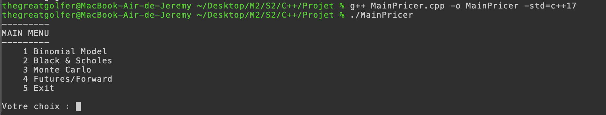
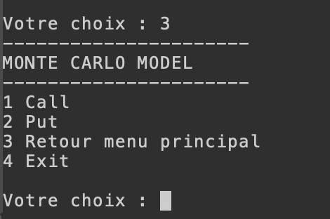
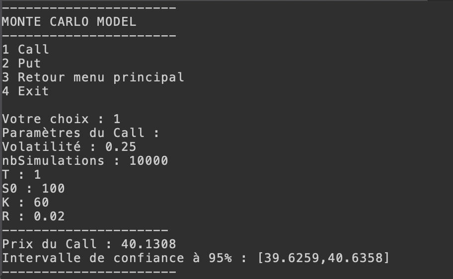

# Projet-Cpp-SELLEM-BOUNAIME
 *  Créé le : 27 avr. 2022
 *  Auteurs : Jeremy SELLEM & Mohamed BOUNAIME

## Sommaire
1. [Contexte](#contexte)
2. [Installation](#installation)
3. [Compilation](#compilation)
4. [Naviguer dans les menus](#naviguer-dans-les-menus)
5. [Pricing](#pricing)
### Contexte
***
Ce projet a été réalisé dans le cadre du cours de C++ dispensé dans le Master 2 IF de l'Université Paris Dauphine, promotion 2021 - 2022. Le but est d'implémenter les méthodes de pricing d'option suivantes : Binomiale, Black & Scholes, Monte Carlo ainsi que le pricing de contrats à terme (futures/forwards).
## Installation
***
Ce projet nécessite l'installation de C++17. Vous trouverez ci-après des guides d'installation pour votre machine :
* [Install C17](https://docs.microsoft.com/fr-fr/cpp/overview/install-c17-support?view=msvc-170): Docs Microsoft
* [On Windows](https://www.geeksforgeeks.org/complete-guide-to-install-c17-in-windows/): Geeks For Geeks
## Compilation
***
Pour exécuter le programme, il faut d'abord cloner le repo Git puis compiler et enfin lancer :
```
$ git clone https://github.com/jeremysellem/Projet-Cpp-SELLEM-BOUNAIME.git
$ cd Projet-Cpp-SELLEM-BOUNAIME
$ make
```
## Naviguer dans les menus
***
Vous arrivez à présent sur le menu principal, de celui-ci vous accéderez aux différentes méthodes de pricing :



Entrez le chiffre de votre choix et pressez la touche Entrée afin d'accéder au modèle (exemple : Monte Carlo) :



## Pricing
***
Choississez le type d'option de la même manière (chiffre + touche Entrée).

Il est temps de renseigner les paramètres de votre option ! Une à une vous pourrez renseigner les valeurs (utiliser le . pour les nombres flottants) :



## Vérification
***
Vous pouvez comparer les résultats produits avec les nombreux pricers disponibles en ligne, parmi lesquels :
* [Binomial Tree](https://www.hoadley.net/options/binomialtree.aspx?tree=B)
* [Black & Scholes](https://financial-calculators.com/options-calculator)
* [Monte Carlo](http://janroman.dhis.org/calc/MonteCarlo.php)
